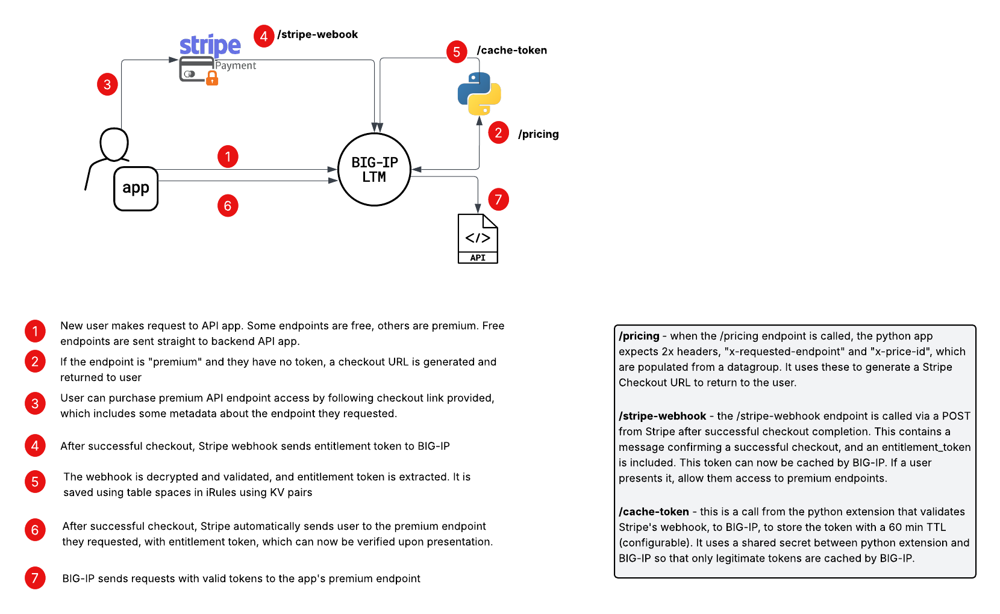

# paywall-irule-demo

## Architectural overview



## Why is this cool?

1. **Business Value:** Notice that the Weather API and the Paywall iRule are *separately managed*. This means:
    - The paywall can be managed **independently** of the app
    - Different pricing models can be tested or implemented based on network metrics
    - Bandwidth/resources could be optimized based on business demand for app endpoints

2. **Competitive offering:** Notice that Cloudflare just announced a similar ["pay per crawl" offering](https://blog.cloudflare.com/introducing-pay-per-crawl/). 
    - This was announced after I started the development of this effort but it is strikingly similar:
      - aimed at API clients
      - aimed to offload the "paywall" from the app owner

3. **Platform independent:** Unlike Cloudflare's offering, this could be customized with various Payment Gateways

4. **Timely:** With the rise of AI-based crawlers, many site owners are now adjusting to the idea of protecting otherwise-free endpoints.

5. **Best practices** for iRules are followed:
    - This is intended for API clients / web crawlers, but will work for browser clients and CLI/API clients alike (allows use of HTTP Headers or URI query parameters for easy browser testing) 
    - iRule [debug logging](https://my.f5.com/manage/s/article/K55131641) can be toggled on/off for troubleshooting
    - Caching of frequently accessed data is enabled with the [table](https://clouddocs.f5.com/api/irules/table.html) command.

### Simple ways for customers to extend further:

1.  **Batched endpoints**. E.g.: this would be trivial to set up:
    - /api/v1/* = free
    - /api/v2/* = $0.50 / hr
2. **Price variations**:
    - Cheaper prices can be offered for internal users
    - Pricing can be tested by business users independently of the application team
    - A long-lived, well-known token could be loaded at initiation for internal team use.
3. **Rate limiting**:
    - Rate limiting could be enforced in iRule logic, outside of the app team
    - bypassing the iRule could be allowed, i.e., an internal-only VIP could run without the iRule to allow fast, easy access to the app internally.
4. **Status page** displaying current valid tokens.
5. **Purge endpoint** for admins to remove tokens before their 3600s TTL expires


## Instructions to run

1. Let's start our mock weather API:
```bash
python3 weather_api.py
```

2. In a new window, let's start our python app which extends some iRule functionality:
```bash
export STRIPE_API_KEY='sk_live_...'
export STRIPE_ENDPOINT_SECRET='whsec_...'
export TOKEN_CACHE_SECRET='' #in this DEMO ONLY, it is "MySharedWebhookKey123"
python3 stripe_webhook.py
```

3. Now let's make API calls to our service.

```bash
curl https://demo.my-f5.com/api/v1/local  # -> this returns local weather data (mock API)
curl https://demo.my-f5.com/api/v1/regional # -> returns regional data
curl https://demo.my-f5.com/api/v1/hyperlocal # -> returns a checkout URL. If you pay ($0.50c in this demo), you'll get access to this premium endpoint!

```

## Why are we NOT using iRules LX?
In this iRule we've built our own python app to do some things that are also possible with iRules LX:

- generate a Stripe checkout URL
- receive and validate Stripe webhook, parse JSON data to cache token

However, I've chosen NOT to use iRules LX, mainly because of the complexity and supportability. Here's my reasoning:

| iRules LX Feature | Benefit |
| ------------- | ------------- |
| ✅ Node.js engine | Full programming model, but old version |
| ✅ HTTP clients | Talk to Stripe, REST APIs, etc. |
| ✅ Redis | We could have used a Redis client to cache tokens |
| ✅ JSON parsing | Native in Node.js |
| ✅ Tight F5 integration | Inline with traffic enforcement |
| ❓ NodeJS 6.9.1 | Outdated NodeJS version |
| ❓ Supportability | More difficult than NodeJS on external VM/container |
| ❌ Future support | No plan for iRulesLX in BIG-IP Next |